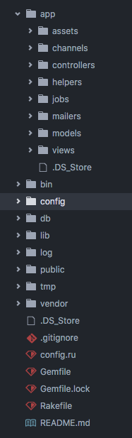
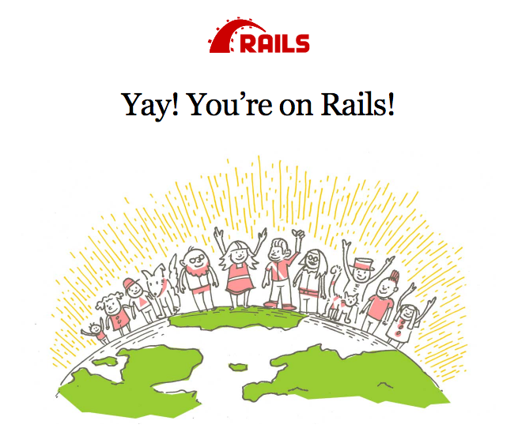

#### Starting your new Rails application

- Let's start a new project. In this module, you will learn how to build a simple online discussion board where users can create posts and comment on them.

- Go ahead and type in your terminal:

  `rails new (your-project-name) --database=postgresql`

- Once you run it, you should see a long output on your console. This is Rails creating the basic app structure which you will work on. Go to your project folder once it is completed.

  `cd (your-project-name)`

  `ls`

- You should see something like this:

  

- Open your favourite editor when you're done.

- `subl` or `atom`.

### Updating your README.md

The Readme is an importance piece of document that provides instructions on how to use your app, install it, or run tests. It should also note other important information that your user/developer would need to know about this project.

For this project though, let's just add the name of the project and your name as it's author.

Example:

```
# MagicForums

A simple discussion board created by me during MaGIC's Full Stack Web Development Bootcamp.
```

### Setting up your gems

In Ruby, `libraries` are coined as `Gems`. Rails itself is a Gem. It is a powerful web development framework that has a plethora of tools at your disposal to quickly craft web applications. Most gems are usually the same, each are created to quickly provide solutions to your needs. For example, `devise` is a popular gem for quickly creating user authentication for web applications.

The `Gemfile` in the directory lists what gems you would use in this project. Let's go ahead and set up some gems we will need for this project.

- After that, add these 2 lines right below it.
- `gem bootstrap`
- You should have something that looks like this.

Next, you should go ahead and add this to a new line below:

  ```
  group :production do    gem 'rails_12factor'  end
  ```

To understand more about rails asset pipeline and the rails_12factor gem, refer to these links:
- The Asset Pipeline(http://guides.rubyonrails.org/asset_pipeline.html)
- rails_12factor(https://github.com/heroku/rails_12factor)

Summary:

The asset pipeline provides a framework to concatenate and minify or compress JavaScript and CSS assets. It also adds the ability to write these assets in other languages and pre­processors such as CoffeeScript, Sass and ERB.

#### We're all set up!

Now that we're all set up, let's run bundle on the terminal. You should see a long list of output. This is Ruby installing the gems that you would require for your application.

Once that's done, let's run `bin/rails db:create` on the terminal to set up our initial database.

Yay, you're done!

- Run rails to run our app. Go to your browser and visit `localhost:3000` and you should see an image similar to the top of the page.




#### Initializing your repository on Github

Let's go to Github and initialize a repository to store your project. Note that you will need an account so be sure to register if you don't already have one.

Lets create a new repository and type your project's name. For this project, let's call it magicforums and click Create Repository.

Once that's created, you should be redirected to a page that displays a link. This is the link to your repository.

Let's copy that and return to your terminal.

On your terminal, type the following:
- `git init`
- `git add .`
- `git commit ­m "first commit"`
- `git remote add origin (paste your copied url here)`
- `git push ­-u origin master`

`git init` initializes a new git repository on your project folder.

`git add .` adds all of your files to be committed into the repository.

`git commit - m "your commit message"` commits all your added files with a message for the commit.

`git remote add (alias) (url)` sets up an alias for your remote repository to push your added files to.

`git push ­-u (alias) (branch­name)` pushes the committed files into your remote repository on github.`-u sets` an upstream so it remembers where to push, thus you only need to type `git push` the next time you push.
