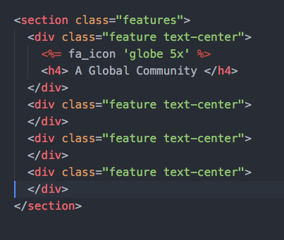

# Day 2 Lessons

## Grid Layouts

- Now that we have set up the our full page photo and half page div with either a background-color or photo.
Let's build this part:

  

- We'll take the concept of flexboxes even further. As mentioned previously, flexboxes
are a layout mode in css that allows you to structure your elements.

- Before we start, let's open our ```gemfile``` and install the font-awesome icons. Type the following into an empty line in your `Gemfile`
  ```
    gem "font-awesome-rails"
  ```

- Don't forget to run ```bundle install ```

- Once done, add the following into your `application.css` file
  ```
    *= require font-awesome
  ```

  before this line.

  ```
    *= require_tree .
  ```

- Now, let's start by calling this section

  ```
  <section class="features">

  </section>
  ```

- In ```landing.scss```, add the following

  ```
  .features {
    display: flex;
    flex-wrap: wrap;
    max-width: 1200px;
    margin: 50px auto;
    justify-content: center;
  }
  ```

- This enables flex, and sets the max-width of this section to 1200px, it can go smaller, but it will never
grow beyond 1200px. ```margin: 50px auto``` essentially centers the section horizontally and adds 50px margin top and bottom respectively.

- ```flex-wrap: wrap``` sets that if the container gets too big for the screen size, it will push it to the bottom rather than break the screen.

- Now, let's create 4 of the same elements inside the features section.

  ```
  <section class="features">
    <div class="feature text-center">
    </div>
    <div class="feature text-center">
    </div>
    <div class="feature text-center">
    </div>
    <div class="feature text-center">
    </div>
  </section>
  ```

- Note: `text-center` is a bootstrap framework class that aligns your text to the center.

- Then, add the following css inside ```landing.scss```:

  ```
  .feature {
    flex: 0 0 280px;
    margin: 20px 10px;
  }
  ```

- Flex is a css function that accepts 3 arguments: ```flex-grow, flex-shrink, and width/height ```

- ```flex-grow``` sets how much should this container grow in contrast with the rest.

- ```flex-shrink``` sets how much should this container shrink in contrast with the rest.

- The final value determines how wide or tall (depending on the flex-arrange of the parent) should be. In this
case, it is locked to 280px wide.

- Next, let's add some icons into the feature. Referring to the [font-awesome documentation](https://github.com/bokmann/font-awesome-rails), type the following inside the first feature div

  ```
    <%= fa_icon 'globe 4x' %>
    <h5> Fostering communities </h5>
  ```

- It should now look like this:

  

- `<%= %>` is an embedded ruby wrapper inside a html file. It allows you to call ruby code inside it. Give it a try, type:
  `<%= 1 + 1 %>` on your `index.html.erb` and refresh it.

- Look at the `flexboxes.html` file in the same folder, it gives you other examples of how you can use flexboxes.

- Challenge: Complete the remaining 3 on your end, feel free to style it tailor it according to your tastes.
