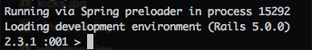
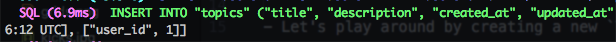

# Day 3 Lessons

## The Rails Console

- The rails console is a powerful tool that lets you load your application into a Ruby REPL.

- This allows you to play around with Ruby Code while trying out things such as adding data into the database, or manipulating them.

- To access the your application's console, type `rails c` in your terminal while being in the your app's folder.

- You should now see something like this:

  

- Let's play around by creating a new `Topic`.

- Go ahead and type `Topic.create(title: "New Topic", description: "Hello World")`

- You should see something like this in your terminal:

  

- Congratulations, you've created your first record in your database.

- If you type `Topic.first`, you should be able to see your topic being rendered on the terminal with an `id` of `1`.

- You can also assign it to a variable, try it:

  ```
  topic = Topic.first

  topic

  ```

- Typing topic should yield you the same result.

- You can also search for it using `find_by`, try it!

  ```
  topic = Topic.find_by(id: 1)

  topic
  ```

- Now let's try creating an associated post.

- Type:

  ```
  topic.posts.create(title: "hello", body: "world")
  ```

- Now Type:

  ```
  Post.first
  ```

- You should be able to see the newly created post, with a `topic_id` of `1`.

- You can also try:

  ```
  topic.posts
  ```

- You should see a response of your post in an array. `topic.posts` calls all posts that are associated with it.

# Challenge

- Create 1 most post that is associated with the topic you created.

- Create 5 comments that are associated with the post you just created.

- Retrieve the third comment from of comments you retrieve.

- Reading from [here](http://guides.rubyonrails.org/active_record_querying.html),
find out what other ways you can query a record from the database.
