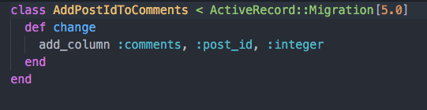

# Day 3 Lessons

## Associations

- Associations is the connection between 2 Active Record Models. In this example, a `post`
may contain many associated `comments` under it.

- To create an association, Rails offer many methods that you can declare in your models.

- For this lesson, we are running with the `Post` - `Comment` association. A `Post` can contain
many `comments` under it, and a `comment` belongs to a `post`.

- Open up your `post.rb` model and inside it add the following method inside the class:

  ```
  has_many :comments
  ```

- This lets Rails know that your posts can contain many comments.

- Similarly, open you `comment.rb` and add the following method inside the class:

  ```
  belongs_to :post
  ```

- This lets Rails know that your comments belong to a post.

- Finally, we are going to generate a migration file to add `post_id` to comments. `post_id` is a foreign key
that lets your application know which post this comment belongs to - using ids.

- Type `rails g migration AddPostIdToComments post_id:integer`

- You should see some feedback. Go ahead and visit your `db/migrate` folder. You should see a new migration file created

  

- Run `rails db:migrate`

### Challenge

- Create another model called `Topic` that has 2 attributes - `title` that is a `string` and `description` that is a `text`. Once you've created it, create associations for the following:

- `Topic` have many `Posts`. `Post` belongs to `Topic`.

- Be sure to create the foreign key `topic_id` for posts.

READING MATERIALS:

[Associations](http://guides.rubyonrails.org/association_basics.html)
