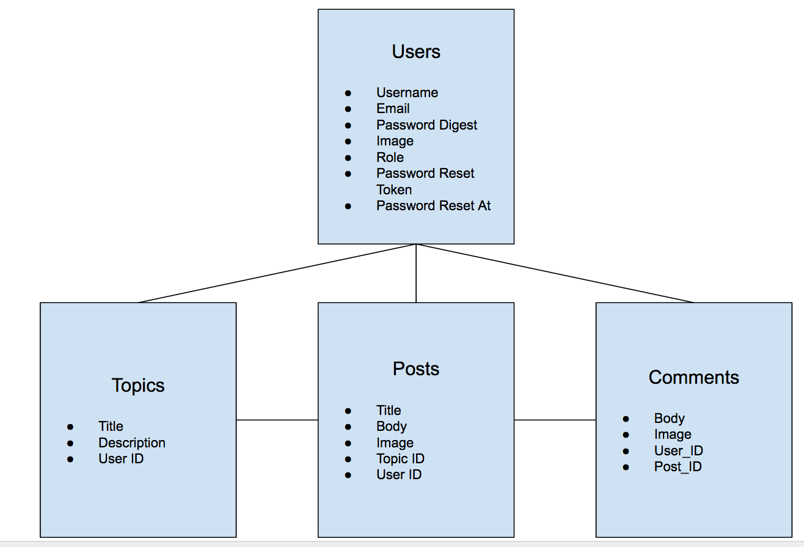
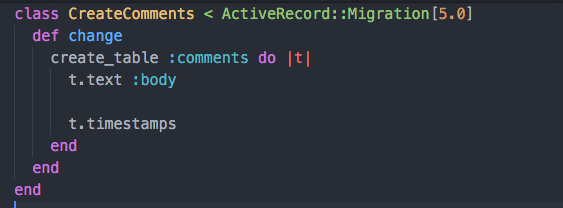

# Day 3 Lessons

## Models

- Models are classes in Rails that interact
with the database to form objects.

- They form the final piece of the `MVC` architecture.

- Models usually represent a table in your database.



- In your discussion board application, it will use 4 models represented like the image above.

- You can read more about models [here](http://guides.rubyonrails.org/active_record_basics.html)

- Let's start with the first model - comments.

- In your terminal, type
  ```
    rails g model Comment body:text
  ```

- This will generate the following feedback:


- Have look at your `models` folder. You should see a new file called `comment.rb`

- Inside your `db/migrate` folder you should also see a new migration file that contains:



- `rails g model` is a Rails CLI (command line interface) that tells your rails app to generate a new model
and database schema called comments, that has one text attribute called body.

- go ahead and run `rails db:migrate` in your terminal after.

- You should see some feedback on the terminal. Go ahead and open your `schema.rb` in your `db` folder

- You should see a newly created table called `comments` in there after running your migrations.

- Note: Rails automaticaly adds the `id`, `created_at`, and `updated_at` fields as well.

### Challenge

- Create another model called `Post` that has 2 attributes - `title` that is a `string` and `body` that is a `text`. Once you've created them.

- Run `rails db:migrate`


EXTRA READING:

[Rails Generate](http://guides.rubyonrails.org/command_line.html#rails-generate)
