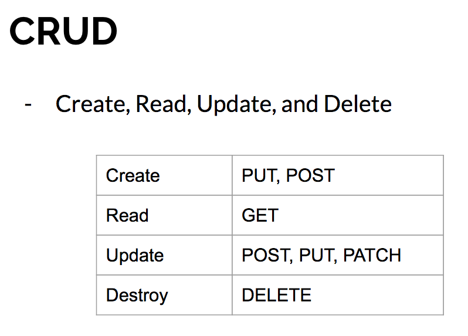
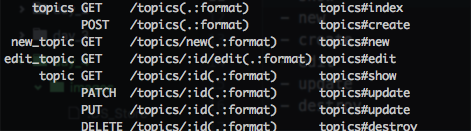

# Day 4 Lessons

## CRUD



- Let's start by creating the `topics_controller.rb`

- Inside it, we're going to add 6 new `methods` called:
  - index
  - show
  - new
  - create
  - edit
  - update
  - destroy

- Your code should now look like this:

  ```
  class TopicsController < ApplicationController

    def index
    end

    def show
    end

    def new
    end

    def create
    end

    def edit
    end

    def update
    end

    def destroy
    end
  end
  ```

- Next, let's go ahead and add `resources :topics` into your `routes.rb`

- Now, go ahead and run rails routes. Notice that new routes have been created for you.

  

- For more information, read up [here](http://guides.rubyonrails.org/routing.html#resources-on-the-web)
