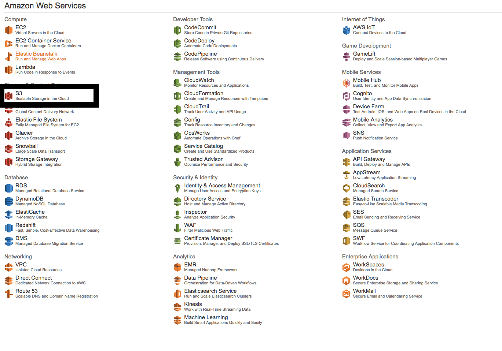

# Day 1 Lessons

## Adding Images

- We're now going to allow images to be added to our posts and comments.

- Let's start by installing a library called `ImageMagick`

- Mac users can just run `brew update` and `brew install imagemagick`

- Ubuntu users type `sudo apt-get update` and `sudo apt-get install imagemagick`

- Windows Users can download it from [here](http://www.imagemagick.org/script/binary-releases.php)

- Next, we're going to add the [carrierwave](https://github.com/carrierwaveuploader/carrierwave) and [mini_magick](https://github.com/minimagick/minimagick) gem.
Remember to `bundle install`. Windows users that are running into issues can use `gem 'mini_magick', '~> 3.5.0'` instead.

- Now we're ready to generate our first image uploader. After bundling, in your terminal type `rails g uploader Image`. You should now see a new folder called `uploaders` and
a file called `image_uploader.rb` inside it.

- Next, we're going to add migrations to your comments and posts. I'll show you only for posts.

- `rails g migration AddImageToPosts image:string`, then `rails db:migrate`.

- Once we're done with the migrations, edit your `image_uploader.rb` as followed:

  ```
  # encoding: utf-8

  class ImageUploader < CarrierWave::Uploader::Base

    # Include RMagick or MiniMagick support:
    # include CarrierWave::RMagick
    # include CarrierWave::MiniMagick

    # Choose what kind of storage to use for this uploader:
    # storage :file
    # storage :fog

    # Override the directory where uploaded files will be stored.
    # This is a sensible default for uploaders that are meant to be mounted:
    def store_dir
      if Rails.env.test?
        "uploads/test/#{model.class.to_s.underscore}/#{mounted_as}/#{model.id}"
      else
        "uploads/#{model.class.to_s.underscore}/#{mounted_as}/#{model.id}"
      end
    end

    # Provide a default URL as a default if there hasn't been a file uploaded:
    # def default_url
    #   # For Rails 3.1+ asset pipeline compatibility:
    #   # ActionController::Base.helpers.asset_path("fallback/" + [version_name, "default.png"].compact.join('_'))
    #
    #   "/images/fallback/" + [version_name, "default.png"].compact.join('_')
    # end

    # Process files as they are uploaded:
    # process :scale => [200, 300]
    #
    # def scale(width, height)
    #   # do something
    # end
    unless Rails.env.test?
      process resize_to_fit: [600, 600]
    end
    # Create different versions of your uploaded files:
    version :thumb do
      process resize_to_fill: [50, 50]
    end

    # Add a white list of extensions which are allowed to be uploaded.
    # For images you might use something like this:
    def extension_white_list
      %w(jpg jpeg gif png)
    end

    # Override the filename of the uploaded files:
    # Avoid using model.id or version_name here, see uploader/store.rb for details.
    def filename
      "#{secure_token}-" + original_filename if original_filename
    end

    protected

    def secure_token
      var = :"@#{mounted_as}_secure_token"
      model.instance_variable_get(var) or model.instance_variable_set(var, SecureRandom.uuid)
    end

  end
  ```

#### EXPLANATIONS

- `extension_white_list` whitelists the type of files that can be uploaded into your app. In this case, it is the image file formats.

- `secure_token` may be a little complicated, but it's function is to assign a random id to your file image if there is a duplicate (this is to prevent duplicated file names)

- `version :thumb` creates another version of the image uploaded with the size of 50px by 50px. Similarly, `process resize_to_fit` resizes the image to make sure it's 600px by 600px.

- One more file to add is `fog.rb` inside your `config/initializers` folder.

  ```
    if Rails.env.test? || Rails.env.development?

    CarrierWave.configure do |config|
      config.storage = :file
    end

  else

    CarrierWave.configure do |config|
      config.storage = :fog
      config.fog_credentials = {
        provider: 'AWS',
        aws_access_key_id: ENV.fetch("AWS_ACCESS_KEY_ID"),
        aws_secret_access_key: ENV.fetch("AWS_SECRET_ACCESS_KEY"),
        region: 'ap-southeast-1',
      }
      config.fog_directory = ENV.fetch("AWS_BUCKET")
      config.fog_public = false
    end
  end
  ```

- I'll explain the AWS part in a bonus section at the bottom.

- Finally, let's mount your uploaders into your model. Again, I'll only show you for the `Post` model.

- Inside your `Post` model add, `mount_uploader :image, ImageUploader`

- This tells your rails application that you are now mounting your `:image` attribute in your database to handle `images`
processed by the `ImageUploader` from `Carrierwave's` library.

- Now let's modify our `edit` form to allow image uploads, add the following code below inside your `form_for` block -

  ```
    <div class="form-group">
      <h4 class="text-center"> Post Image </h4>
      <div id="preview-image">
        <% if @post.image? %>
          <%= image_tag @post.image, class: "img-settings img-responsive center-block" %>
        <% end %>
      </div>
    </div>

  <div class="form-group">
    <%= f.file_field :image, id: "post_image_field", class: 'form-control image-uploader' %>
  </div>
  ```

- The first part of the code checks to see if there is already an existing image inside your post, and shows it if there is one.

- The second part (`file_field`) creates a html file field input where you will be able to upload your image into the database.

- With this done, your challenge is to add the same of comments and posts forms (new and edit). Note that your `new` form may not need
the image previewer.

- One final tweak, we'll need to allow `:image` to be permitted as a parameters now in your controllers so add them appropriately into your `strong params` for `posts and `comments`.

## BONUS: Image Uploading in Production

- WARNING: You will need a credit card for this part.

- Sign up for a new account on [Amazon S3](https://aws.amazon.com/s3/). You get one year free and it's pay for what you use.

- Next, click on `s3`

  

- You should see `create bucket` on the top left.

  

- Add your `bucket name` and set the `region` to `Singapore`.

- NOTE: make sure your name has no spaces.

- Next, click on `services` on the top `navigation bar` and hover to `security and identity`. click on `IAM`

- Click on `users` at the sidebar and click `create new users`. Create one user by filling it the user's name (just one field is enough even though 5 is provided) and click
  `create` at the `bottom right` of the page.

- You should see a success page with a a link `Show User Security Credentials`. Click on it to reveal your credentials.

- Copy it to somewhere safe, we're going to need it soon.

- Now let's install '[figaro](https://github.com/laserlemon/figaro)' gem and `[fog](https://github.com/fog/fog)`. (Don't forget to `bundle`)

- Figaro allows you to manage your environment variables without revealing it to other users (since most of these keys have to be secure).

- In your terminal, run `figaro install`

- You should see terminal updating your `.gitignore` file and adding a new file called `application.yml` into your `config` folder.

- Inside your `application.yml` file, add the following:

  ```
  production:
    AWS_ACCESS_KEY_ID: "your_aws_access_id"
    AWS_SECRET_ACCESS_KEY: "your_aws_access_key"
    AWS_BUCKET: "your_image_bucket_name"
  ```

- Congrats, you've hooked up your application to AWS. Images that you've uploaded in production will now be stored in this bucket instead of your application.
