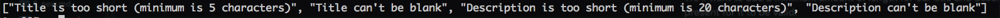

# Day 1 Lessons

## Model Validations

- We're going to learn about validations now. Rails `ActiveRecord` provides methods for validating your data. For example,
an image size can only be 1mb or smaller, a post's body must be at least 20 characters long, an email must adhere to a proper format.

- You can find the list of validation methods [here](http://guides.rubyonrails.org/active_record_validations.html)

- Let's start with our topic.

- We'll want to add a minimum amount of length for our title and description. We also want it to be present for it to be valid.

- Let's go ahead and edit it:

- in your `Topic.rb` model, add this:

  ```
  validates :title, length: { minimum: 5 }, presence: true
  validates :description, length: { minimum: 20 }, presence: true
  ```

- What we've done is that we've now asked Rails to validate title and description, with a minimum length of 5 and 20 respectively,
and has to be present. Otherwise, Rails will reject it and you will run into an error.

- Rails will also add error messages for you to access and display to your users. We'll now refactor our topics controller to show it.

- In your `create` method, add `binding.pry` here:

  ```
  def create
    @topic = Topic.new(topic_params)
    binding.pry
    if @topic.save
      redirect_to topics_path
    else
      redirect_to new_topic_path
    end
  end
  ```

- Go ahead and create a new empty topic (make sure it's invalid) and head to your terminal running the server.

- Type `@topic.save!`, you should see a rollback as you've failed your validation checks.

- To see your `errors`, you can type `@topic.errors.full_messages`. You would see something like this arranged in an array:

- For example:

  

- Next, we're going to render these error messages to your users. Remove `binding.pry`.

- Let's create a new file called `_flash_messages.html.erb` in your `views/partials` folder.

- Paste the following code into it:

  ```
  <% flash.each do |k,v| %>
    <section class="flash-messages">
      <div class="alert alert-<%=k%>">
        <button type="button" class="close" data-dismiss="alert">
          &times;
        </button>
        <div class="message">
          <%= display_message(v) %>
        </div>
      </div>
    </section>
  <% end %>
  ```

- The following code looks for a [flash](http://guides.rubyonrails.org/action_controller_overview.html#the-flash) message, and renders it in html.
Flash messages are a way of displaying system messages to the user (for example: "You've successfully logged in"). They last only for one http request
and is cleared after that. On the styling of flash messages, check out [Bootstrap's Alert Component](http://getbootstrap.com/components/#alerts)

- Now let's render this partial in your `application.html.erb` inside `layout`. Paste the following code `<%= render partial: "partials/flash_messages" %>` beneath your header.

  ```
  <body>
    <div id="header">
      <%= render partial: 'partials/header' %>
    </div>
    <%= render partial: "partials/flash_messages" %>
    <%= yield %>
  </body>
  ```

- Now let's style our flash messages, create a new file called `flash_messages.scss` in your `stylesheets/views` folder and paste the following code:

  ```
    .flash-messages {
    position: fixed;
    top: 0;
    left: 0;
    right: 0;
    z-index: 2;

    p {
      margin: 0;
    }

    .alert {
      border: 0;
    }

    .alert-success {
      background-color: green;
      color: $white;
    }

    .alert-danger {
      background-color: red;
      color: white;
    }

    .close {
      line-height: 0;
      padding: 7px;
      font-size: 40px;
      opacity: 1;
      color: $white;
    }

    .list-styling {
      width: 500px;
      margin: 0 auto;
      list-style-type: none;
      text-align: left;
    }

    .message {
      text-align: center;
      font-size: 16px;
      text-shadow: 1px 1px 1px rgba(0,0,0,0.6);
    }
  }
  ```

- One final file to add is the `flash_messages_helper.rb` inside your `helpers` folder. `Helpers` are `Ruby methods` that can be used in your views
if they get to complicated, allowing you to keep your code tidy to allow separation of concerns.

- Paste the following code in it:

  ```
  module FlashMessagesHelper

    def display_message(value)

      return content_tag(:p, value) unless value.kind_of?(Array)

      content_tag :ul do
        value.collect { |message| content_tag(:li, message, class: 'list-styling') }.join.html_safe
      end
    end
  end
  ```

- The code above creates a new helper method that is called `display_message` that takes in one argument called by the `flash_messages` partial.

- Finally, we need to render these messages in our controller. Let's add the code into our `TopicsController` `create` action.

  ```
  def create
    @topic = Topic.new(topic_params)

    if @topic.save
      flash[:success] = "You've created a new topic."
      redirect_to topics_path
    else
      flash[:danger] = @topic.errors.full_messages
      redirect_to new_topic_path
    end
  end
  ```

- Flash is actually a `hash`, it has a `key` and a `value`, which is why you see
`flash.each do |k,v|` inside your `flash_messages` partial. It essentially splits the hash into a key and a value
that can be used inside the `block.`

- The key is used to determine the type of `alert` is being rendered as seen here `<%=k%>` while `v` is the contents of the message.

- The helper method helps determine if the message we are sending is a `string` or an `array`.

- If it is an array, it will collect each message in the array and render a `<li>` tag to it, seen in this part of the code in your `helper`:

  ```
  content_tag(:li, message, class: 'list-styling')
  ```

- The challenge now is to add flash messages for the remaining actions inside your `topics`, `posts`, and `comments` controller. Give it a try.
