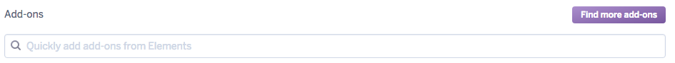

## Adding Emails to Heroku

- Inside `heroku`, go to `resources` and inside `find addons`, search for `sendgrid`



- Next, we'll need to configure `config/environments/production.rb` and add the following code:

  ```
  config.action_mailer.default_url_options = { host: '<your-heroku-url>' }
  config.action_mailer.delivery_method = :smtp
  config.action_mailer.smtp_settings = {
    address: 'smtp.sendgrid.net',
    port: '587',
    authentication: :plain,
    user_name: ENV.fetch('SENDGRID_USERNAME'),
    password: ENV.fetch('SENDGRID_PASSWORD'),
    domain: 'heroku.com',
    enable_starttls_auto: true
  }
  ```

- You should know have emails working.
