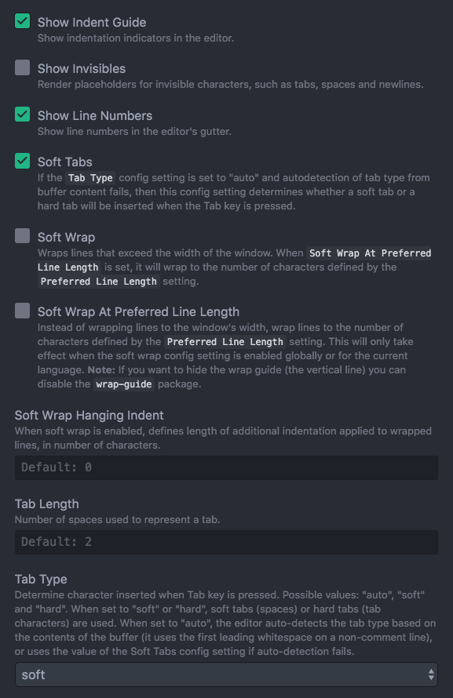

# Finishing Up

- As we wrap up our first project, I'd like you to take the time to:
  - ## FIX YOUR INDENTATION:
    
    - Go to your atom settings and set the following:
      - Tick `Show Indent Guide`
      - Soft Tabs `ticked`
      - Tab Type set to `soft`
      - Tab Length set to `2`
      - P/S: Sublime Users will need to google this.

    - All elements nested inside should have one indentation tab. Example:
      ```
        <div class="1">
          <div class="2">
            <div class="3">
            </div>
          </div>
        </div>
        ```

    - All ruby code should be indented properly as well with one tab:

      ```
        class Ruby
          def hello_world
            x = 1
            if x == 1
              "hello world"
            else
              "no hello world"
            end
          end
        end
      ```

    - Likwise, CSS Styling with one indentation tab:

      ```
        .class {
          width: 100%;

          .nested-class {
            height: 100%;
          }
        }
      ```

- Once you've fixed your indentation, play around with your application:
  - Fix up things that look weird, for example, images or text that are spilling out of your
    containers.
  - Make sure the following works:
    - Users can register, edit, and update their profiles.
    - Users can log in and out.
    - All form of image upload is working.
    - Only admins can create topics and edit or delete other people's comments or posts.
    - Only logged-in users can create posts and comments.
  - Push everything to `Github`
