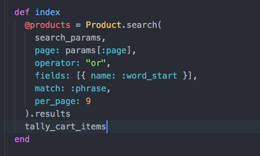
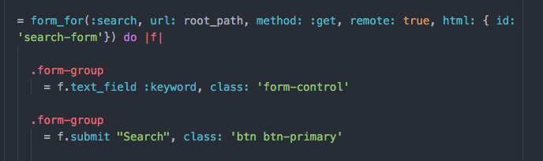
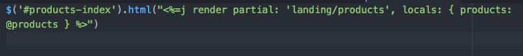

# A Simple Search Engine

- We'll be implementing a simple search engine using searchkick, searchkick requires elasticsearch so be sure to set it up.

- After installing the gem, we can enable `searchkick` by typing `searchkick` method in the selected `Model`.

- Next, we'll implement the search function on the controller.

  

  ```
  def search_params
    params.dig(:search, :keyword) || "*"
  end
  ```

- In reference to the [documentation](https://github.com/ankane/searchkick):
  - [dig](http://ruby-doc.org/core-2.3.0_preview1/Hash.html#method-i-dig) is a ruby
  hash method that allows you extract a value by the given key or returns a nil. In this case, I've set it to either return a search string or "*" if it's nil.
  - `page` is a `kaminari` method that allows searchkick to play well with kaminari gem.
  - `operator` allows me to search for multiple items with multiple keywords.
  - `fields` specifies the attributes in the model I want to search, in this example I only have product name, but you can add more: e.g description, color..
  - `match` and `word_start` allows me to match a phrase instead of requiring the exact match.
  - Finally, `per_page` is another kaminari method that limits the results to only 9 items per page.

  

- This is the search form used to tie with searchkick.

  

- Finally, you can also set form to fire as an `ajax`. Refer to your materials from the first project.
