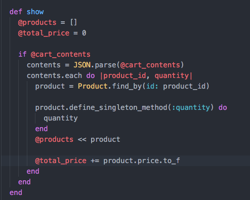
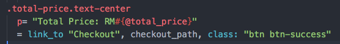
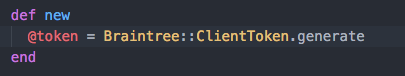
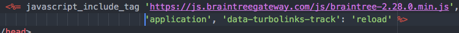
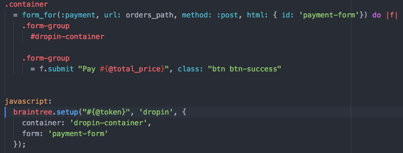
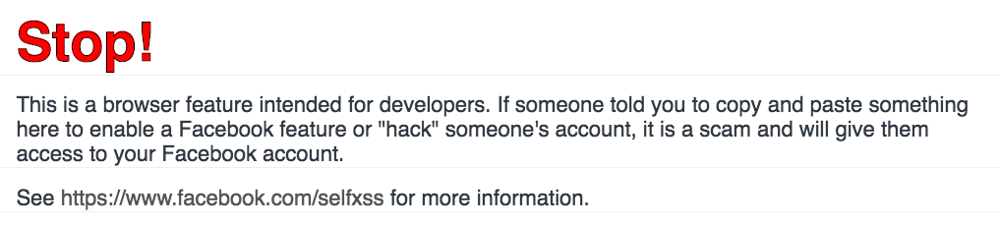
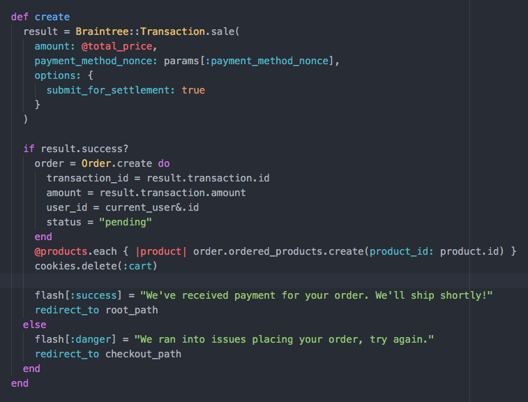

# Implementing Braintree

- Pre-info: (My orders schema)

  ```
  create_table "orders", force: :cascade do |t|
    t.integer  "user_id"
    t.integer  "status"
    t.datetime "created_at",     null: false
    t.datetime "updated_at",     null: false
    t.decimal  "amount"
    t.string   "transaction_id"
  end
  ```

- Continuing off the other tutorial where you've set up braintree and implemented the carts controller.

---

  `carts#show`

  

- Here, we are reiterating the cookies hash that we've [parsed](http://ruby-doc.org/stdlib-2.0.0/libdoc/json/rdoc/JSON.html#method-i-parse) using the [JSON](https://en.wikipedia.org/wiki/JSON) library (You can also find out about JSON generate [here](http://ruby-doc.org/stdlib-2.0.0/libdoc/json/rdoc/JSON.html#method-i-generate)).

- For that, we are using the [each... |k,v|] method as described [here](https://ruby-doc.org/core-2.2.0/Hash.html#method-i-each)

- For this loop we're doing 2 things, we're fetching every `product` object from our database using the `key` - because we've used our product id as the key of the hash.

- Remember (product_id => quantity) in your carts demo.

- `define_singleton_method` as explained [here](https://ruby-doc.org/core-2.2.2/Object.html#method-i-define_singleton_method) allows you to create new instance methods for objects on the fly. In this case I've used it to attach `quantity` of the products ordered to the object so I can easily fetch it in the views later.

---

- We'll need to add a checkout button in your carts view.

  `checkout button`

  

- Fairly straightfoward, I'm just creating a new checkout button.

---

- This is the newly created checkout controller

  `Orders Controller#new`

  

- You'll also need to find a way to retrieve your total price and products array.

- Hint:
  - Use a `before_action` filter on your controller.
  - Use `.each do |product_id, quantity|` to retrieve each of your product and price.
  - Use a `+=` operator. E.G:
    ```
      total = 0
      total += 1

      puts total (will show you 1)
    ```
  - Use `binding.pry` to play around inside your controller action.
  - I've used this in the carts controller.
  - For your products, use the [<<](http://docs.ruby-lang.org/en/2.0.0/Array.html#method-i-3C-3C) to store your products array.

---

- Now to pass the token to my `braintree form`.

  `Application layout`

  

  `orders#new`

  

- Here, we're using rails `form_for` generator to create a new form. Inside it, we've created a `#dropin-container` to let paypal know that this is the element we want to render our form in.

- What braintree does is that it embeds a form inside `#dropin-container`. The `function` for this is actually imported from `js.braintreegateway/....` that you included in your application html.

- It also overrides your form `submit` to first send the transaction details to its server before you post your form to your controller (remember `url: orders_path`).

- Trivia: This is how malicious JS works as well. Hackers can inject malicious javascript into your browser and take over your machine using the same principle. (This is why if you inspect Facebook's website it'll warn you not to paste anything into the console.)

  

---

- We'll now create the `create` action for your controller.

  

- `This is how I've implemented it for my app, remember that your codebase and database may be different.`

- The first snippet with `Braintree::Transaction` is simple, you've seen it [here](https://developers.braintreepayments.com/guides/customers/ruby) too.

- All that code does is make a new `post` to Braintree's API to create a new transaction.

- `payment_method_nonce` is the callback received from Braintree's server from the payment form.

- The flow works like this:
  - You generate a new form using a token fetch from braintree's server.
  - Once the customer keys in their credit card details, a secure transaction is sent again
  to Braintree's server to handle the credit card processing.
  - You received a callback called `payment_method_nonce` in your controller (defined by your `form_for url`) that you can use now to create a new transaction with your account. (NOTE: The payment isn't actually made during the js form, it is just a validation process for the credit card).
  - `Braintree::Transaction.sale` is the method actually handling the transaction.
  - You can also add in your customer details (assuming you have a current_user logged in) by referring to this [documentation](https://developers.braintreepayments.com/guides/customers/ruby).
  - Referring to the `github documentation`, we get to check if the transaction was a success by calling `result.success?`.
  - If the transaction was successfully, we'll receive a `Braintree` object that contains information such as the `transaction_id` stored in your account on `braintree`, the amount, etc. Use `binding.pry` to find out more about what is stored in the callback.
  - The rest is fairly familiar, using the information I've received, I created a new order and associate the products using the `OrderedProducts` association.
