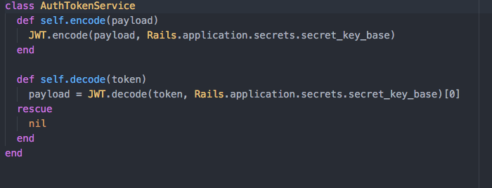

# JSON Web Token

- [JSON Web Tokens](https://en.wikipedia.org/wiki/JSON_Web_Token) are a hash that allows sensitive data to be securely sent to an application.

- We will be using this [library](https://github.com/jwt/ruby-jwt) to securely generate JWTs that the app can store and use to authenticate users. The hash will store the user's ID.

- Once installed, we'll create a `service` that our controllers can use to quickly generate tokens.

  

- Now, our controller can generate a secure token by passing in the appropriate hash, for this project, we only need to pass in the user's id. So we can generate this by doing:

  ```
  token = AuthTokenService.encode({ user_id: id })
  ```

- Once the token is hashed, you will need to refer to the project requirements on how to pass this as a hash to the app.
