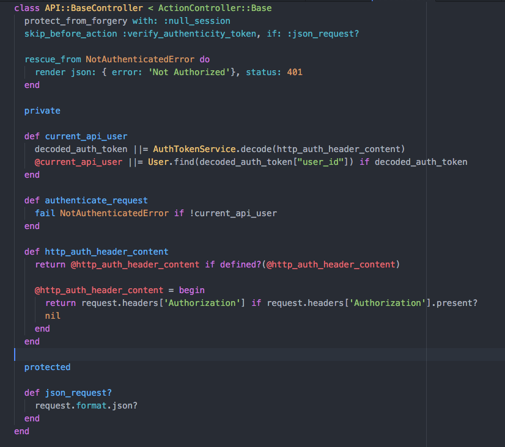
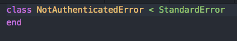

# Setting Authorization Headers

  

- We'll start with `current_api_user`. This is a method defined similar to `current_user` - it is a method for us to quickly fetch the logged in user object from the database, the only difference here is that we do not add the `helper_method` to it because we will not be rendering this in the view.

- Similar to the `before_action :authenticate_user!`, we'll need a way to check for authentication on the API as well. This can be achieved by checking the request headers sent from the application itself.

- To do this, we'll need to check for the `Auhorization` key sent from the app, this can be received from `request.headers['Authorization']`. In the example, we've created a method called `http_auth_header_content` to fetch the `Authorization JWT` stored on the mobile app that we sent earlier during the user login.

- This method is then called by `current_api_user` to be used by the `AuthTokenService`(refer to JSON Web Token section) to fetch the user id.

- Finally, we also have a `rescue_from` set in the event that a current_api_
user is not fetched. This is a simple error prompt that the user is not logged in.

- Note that the class `NotAuthenticatedError` is called. We'll need to build that as well. Create a new folder called `errors` and the following to it:

  

- This is a very simple class that inherits of `StandardError`, which is a Ruby Class as seen [here](https://ruby-doc.org/core-2.2.0/StandardError.html).
